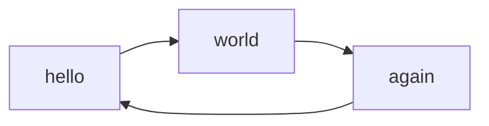

Test Page
##
 
Built using mkdocs markdown to static site creator.

    pip install mkdocs mkdocs-material

wavedrom plugin for timing & logic diagrams.

    pip install markdown-wavedrom

mermaid plugin for fsm diagrams.

    pip install mkdocs-mermaid2-plugin

Wavedrom Timing
--

wavedrom (
    { signal: [{ name: "Alfa", wave: "01.zx=ud.23.456789" }] }
)

Wavedrom Logic
--

wavedrom (
    { assign: [
        ["out",
            ["|",
                ["&", ["~", "a"], "b"],
                ["&", ["~", "b"], "a"]
            ]
        ]
    ]}
)

Mermaid Graph
--

Paragraph at the bottom.
